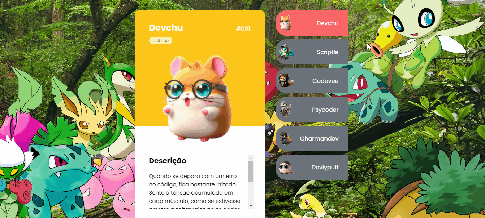

# Projeto Pokedeves 
Um projeto realizado em 3 dias saindo do zero absoluto de conhecimento de programação.

[]

## Tecnologias utilizadas

- HTML
- CSS
- JS

## O que aprendi nesse projeto

Com esse projeto aprendi a base do HTML e como é sua estrutura, como fazer as marcações, aprendi como estilizar o HTML com o CSS e por fim aprendi a fazer a interação utilizando o JS.
